# Olist Brazilian E-commerce (springboot/kotlin API Servive)

[//]: # (> 🚧 **Deployment Status:**  )

[//]: # (> <a href="https://olist-service.onrender.com" target="_blank">)

[//]: # (👉 First deployed on Render ***Health Check***)

[//]: # (</a>)

[//]: # ( )

[//]: # (This project is currently ***in progress*** and being prepared for the next deployment phase on AWS.)

---

## 📌 Overview 

**Olist Service** is a springboot+kotlin microservice project that has been migrated into a   <a  href="https://github.com/Thiraporn/SpringBoot_AuthenWithJWTs" target="_blank">  Spring Boot Security + JWT  </a>  to improve backend development skills, particularly in **microservice integration and service-to-service communication practices**.

The service is part of a <a href="https://github.com/Thiraporn/olist_e_commerce" target="_blank"> Olist e-commerce analytics project </a>,  which focuses on data analysis and insights derived from the same dataset.

This project leverages the
<a href="https://www.kaggle.com/datasets/olistbr/brazilian-ecommerce" target="_blank">
Olist Brazilian E-commerce Dataset
</a>
,which provides valuable data for learning, system design, and backend architecture practice. 

---

## 📐 Overall Architecture
Illustrates the overall system architecture, deployment environment, microservices, shared libraries, and databases.

---

## 🛠 Tech Stack

- Java 17 
- Spring Boot 3.5.13
- Spring Security
- JWT Authentication
- PostgreSQL
- Maven  
- REST API
- Microservice Architecture
- JUnit5
- Mockito 5.4.0
- Neon (Free-tier PostgreSQL Database)
- Render (Free-tier Deployment)

> *Additional technologies used for deployment and demo*

- AWS EC2
- Docker
- Jenkins CI/CD Pipeline
- GitHub Actions

---
## 📦 Common Libraries

This project integrates a shared library to centralize reusable components and ensure consistency across services.
👉 
<a href="https://github.com/Thiraporn/common-libs"> Common Libs</a>

---
## 📄 Notes 

This project focuses on:

- Real-world backend system design
- Secure authentication flow using JWT
- Clean and scalable architecture
- Preparation for microservice-based systems

  

---

## 🚧 Ongoing Improvements

- Software
  <a href="https://github.com/Thiraporn/Development-Documents/tree/main/documents" target="_blank">
  Development Documentation
  </a>

---
## 🚀 Version

* `0.0.1-SNAPSHOT` → first release (Spring boot and plug in authentication-service) 
* `1.0.0` → v1.0-enable-kotlin (7/7/2026 7.00 p.m.)
  - upgrade-kotlin 
  - simple dashboard revenue analytics
  - simple dashboard customer analytics
  - simple dashboard delivery analytics
  - simple dashboard sale analytics
  - simple dashboard seller and product analytics

--- 

## 🧪 API Testing

The following screenshots demonstrate API testing using **Postman**.

### 1. Register

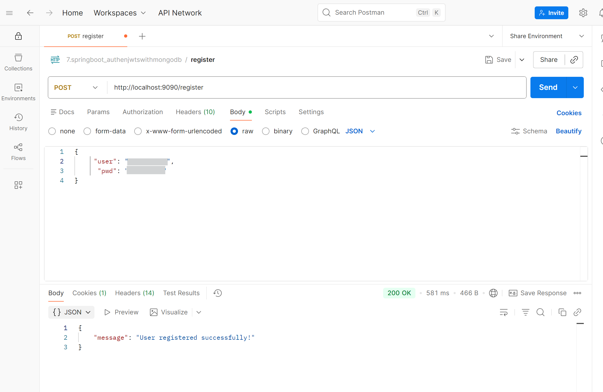

### 2. Authentication

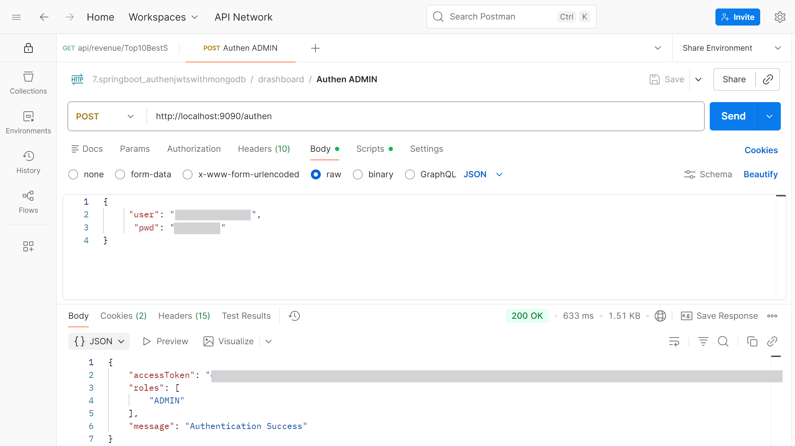

### 3. Refresh Token

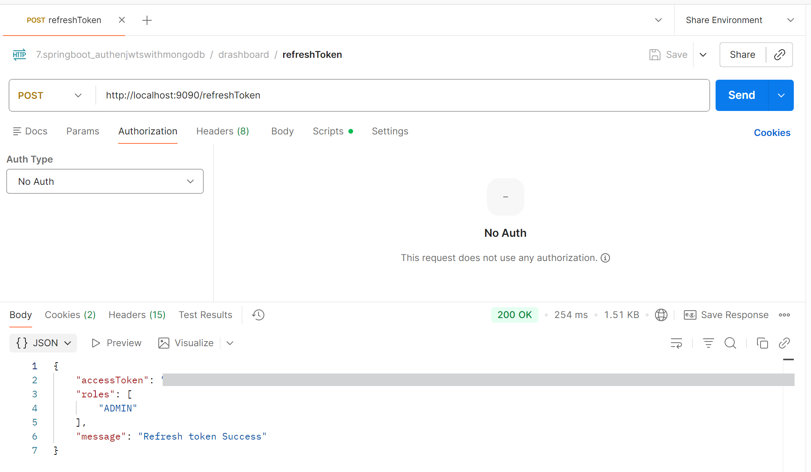

### 4. Sample API Call
**Business Question : What are the top 10 best-selling products by number of orders?**
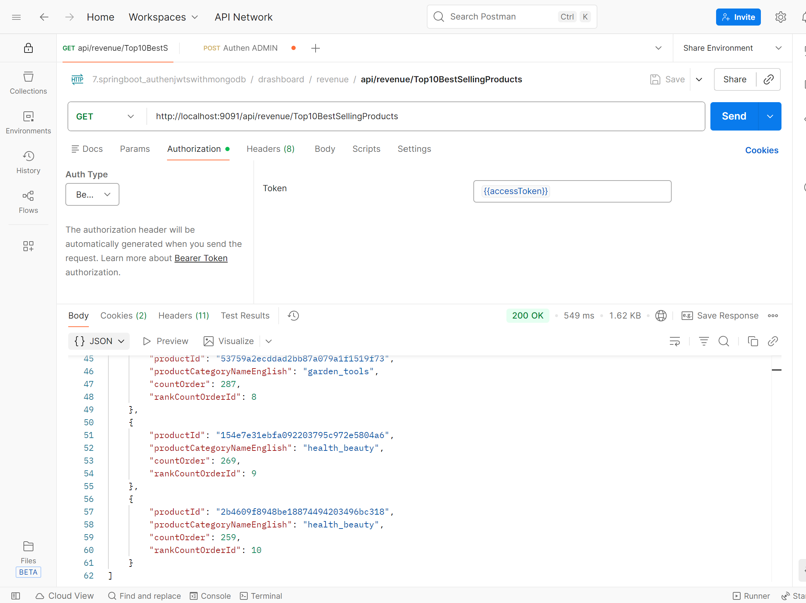

**Business Question : Which cities or states have the highest number of customers?**
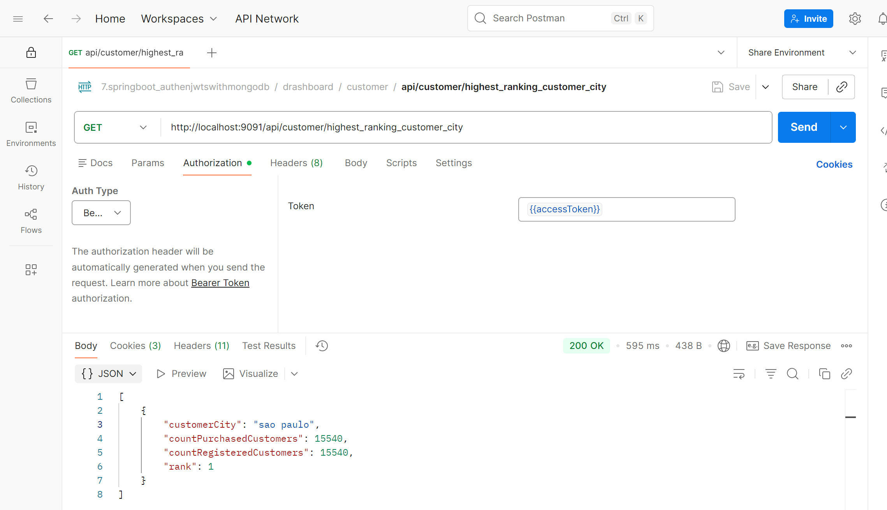

### 5. Error Handling

- **Account Already Exists**

  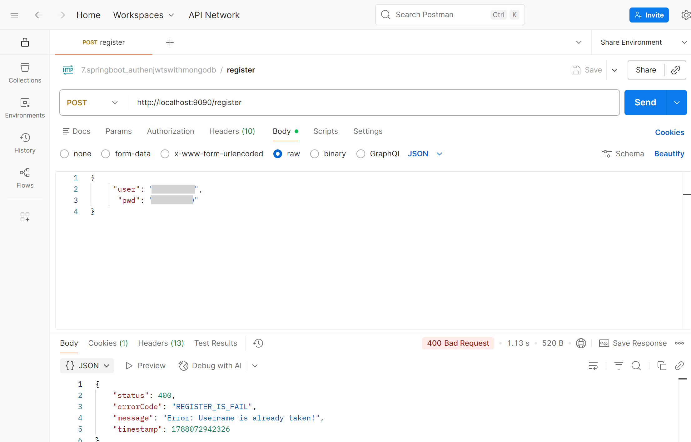
   
   
- **Unauthorized**

  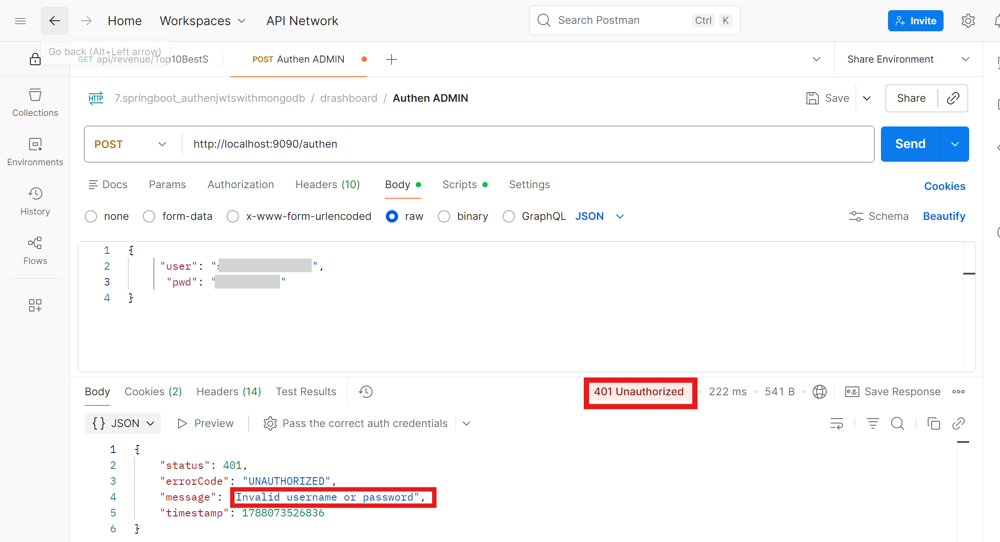
   
   
- **Logout or Calling API Without Authentication**

  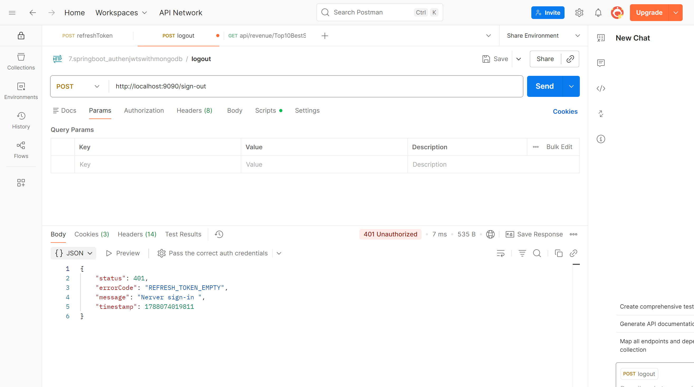
   
   
  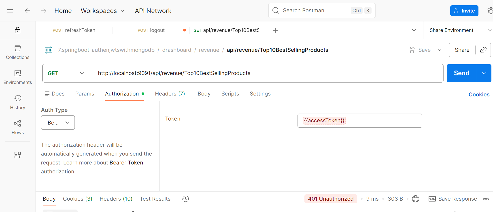

### 6. Demo

👉 **Now available on Render** <a href="https://olist-service.onrender.com" target="_blank">
    ***Check it out !..***
  </a>

  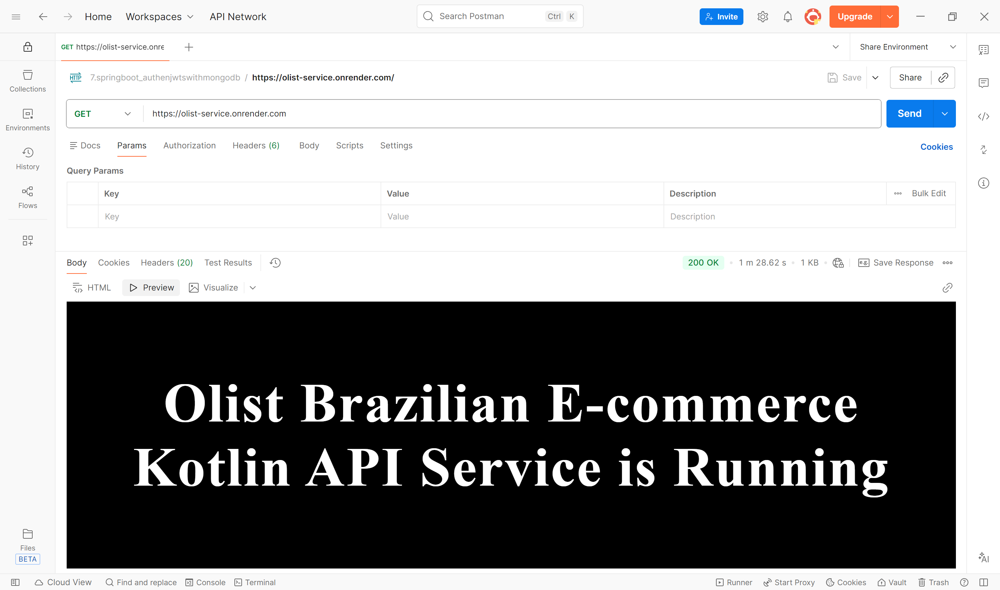
   
   
  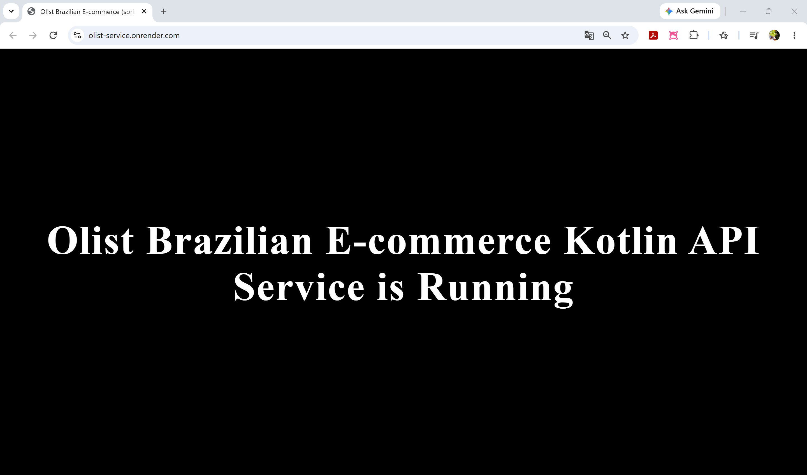
 
---  
 
### 🚀 Deployment & DevOps

**Authen-Service**

<a href="https://springboot-authenjwtswithmongodb.onrender.com" target="_blank">
For Backend API Health Check
</a>

**Olist-Service**

[//]: # (**Deployment Branch:** [`DEV-AWS-DEPLOY`]&#40;https://github.com/Thiraporn/olist-service/tree/DEV-AWS-DEPLOY&#41;)

> **Demo:** The [`DEV-AWS-DEPLOY`](https://github.com/Thiraporn/olist-service/tree/DEV-AWS-DEPLOY) branch is used to demonstrate the AWS deployment process.
>
> This is for training purposes. I stopped the AWS services after completing this project.
>
> Please check the [Olist-Service on Render](https://olist-service.onrender.com) for the current health check instead.

**Hello from the browser**

**Hello from Postman**

**Health Check from Postman**

**Sample API Calls**

**Business Question: Which sellers generate the highest total revenue?**

**Business Question: Which product categories generate the highest revenue?**

---

[//]: # (<a href="https://github.com/Thiraporn/Development-Documents/tree/main/documents" target="_blank">)

[//]: # (  Development Documentation)

[//]: # (</a>)

### 🚀 Jenkins Pipeline & Deploy Logs
 
> **Deploy Configurations:** The [Development Documentation](https://github.com/Thiraporn/Development-Documents/tree/main/documents/Deploy_Configurations) demonstrates the AWS deployment process in the section below.

Here is an example of the Jenkins Pipeline:
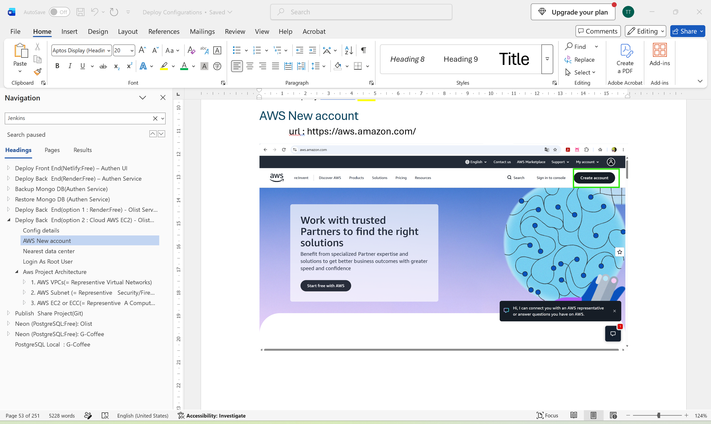

 
Here is an example of the logs when the Jenkins Pipeline completes successfully:

---
 

## 🌐 Related Projects,

- Integrated and migrated authentication system to Spring Boot Security with JWT:   
  
    
  
<a href="https://github.com/Thiraporn/SpringBoot_AuthenWithJWTs" target="_blank">
  Authentication Repository
  </a>|<a href="https://springboot-authenjwtswithmongodb.onrender.com" target="_blank">
  API Health Check
  </a> 

 
     
    
- Data Analysis:  
  
    
  
<a href="https://github.com/Thiraporn/olist_e_commerce" target="_blank">
  E-commerce Sales Analysis Repository 
  </a>

     
    

---